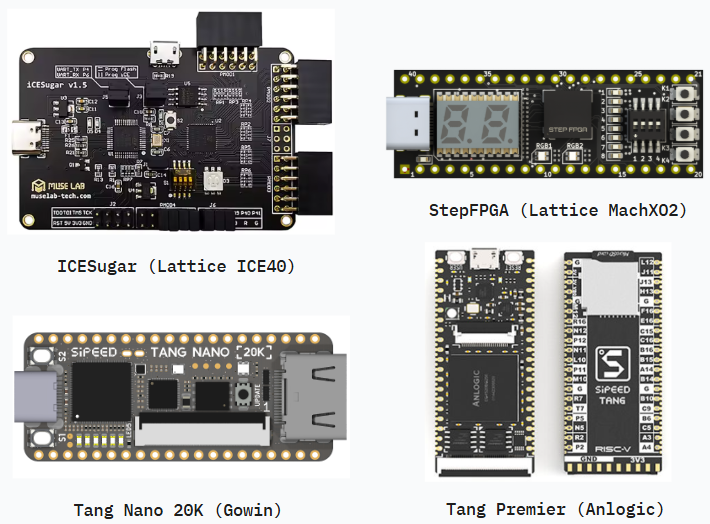
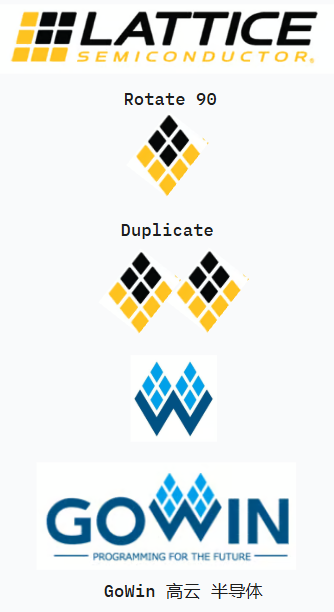

# OpenFPGA Tutorial

> Verilog examples on Lattice (ICE40, MachXO2), Anlogic and Gowin FPGA.

## ICESugar (Lattice ICE40)

- 5280 Logic Cells (4-LUT + Carry + FF)
- Yosys
- nextpnr-ice40

## StepFPGA (Lattice MachXO2)

- 4320 LUTs
- Lattice Diamond

## Tang Nano 20k (GoWin)

- 20K logic unit (LUT4/LUT5 hybrid architecture)
- Yosys
- nextpnr-himbaechel

> [!NOTE]
> GoWin FPGA uses stolen IPs and hires (and even company Logo) from Lattice, to form the cheap Chinese FPGA startup company.

## Tang Premier (Anlogic)

- 20K logic unit (LUT4)
- Anlogic TD
